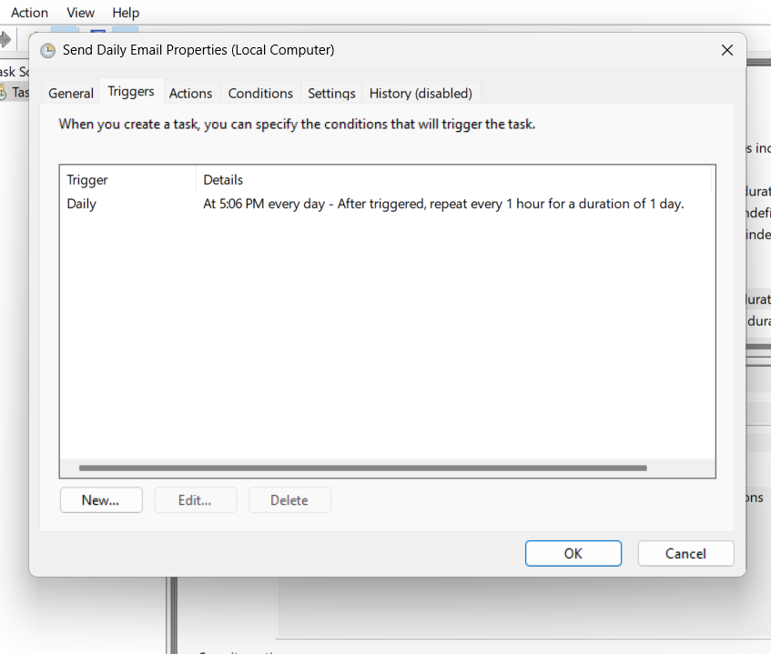
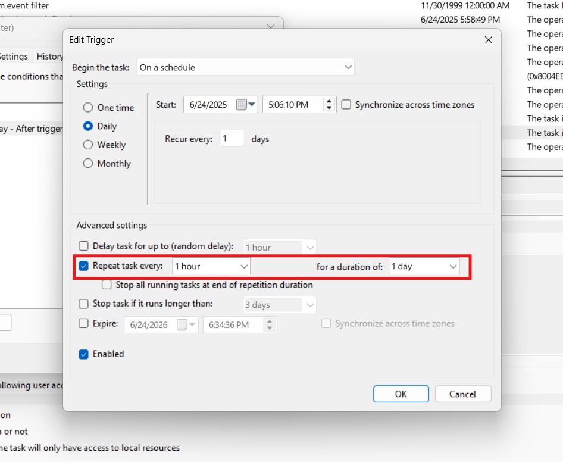

# Python Email Sender

This project is a contains a simple Python script that sends emails using the `smtplib` library. It can be configured to run periodically using Windows Task Scheduler or CRON.

## 📦 Features

- Fetches live stock market value of Apple from Yahoo Finance (https://finance.yahoo.com/quote/AAPL?p=AAPL) using `beautifulsoup` & `requests` libraries
- Sends an email via SMTP (e.g., Gmail) using `smtplib` library
- Can be scheduled to run automatically using CRON or Windows Task Scheduler(e.g., daily)

## 📷 Screenshots of Task Scheduler






## 🛠 Requirements

- Python 3.9
- Internet connection
- Email account with SMTP access (e.g., Gmail, Outlook)

## 📄 How to Use

1. Clone the repository or download the script.

2. Install any required dependencies:
   ```bash
   pip install -r requirements.txt
